# Harry Potter Spell Game

[Link to the live project here](https://breakellrz.github.io/Harry_Potter_Quiz/)

- Harry Potter's Spell Game is a game based on the Rock, Paper, Scissors, Lizard, Spock game. It is the same principle and has the same rules. Certain spells beat other spells. In this game, you are in a battle arena and are against Draco Malfoy the character in the Harry Potter movies. The background image is an AI image of Hogwarts. The website has three pages, 'Home', 'Rules', and 'Battle Arena'. The 'Home' page consists of a start and rules button, along with an input field for users to put in their username. The 'Rules' page consists of all the rules for the game, along with a back button to the 'Home' page. The 'Game Arena' consists of pressable buttons for the user to choose which spell he/she is going to use against the computer (Draco), a score section to show the user who is winning the battle, and a 'Home' button to return the user to the main 'Home' screen. The game is completely random just like Rock, Paper, Scissors, Lizard, Spock. It is based on luck, but I hope the users have more fun with it because of the Harry Potter theme. To win the user has to reach a score of 10 before the computer (Draco) or else the user will lose and the scores will be reset. There is an audio button in the footer for users to get immersed in the game more with some magical music.

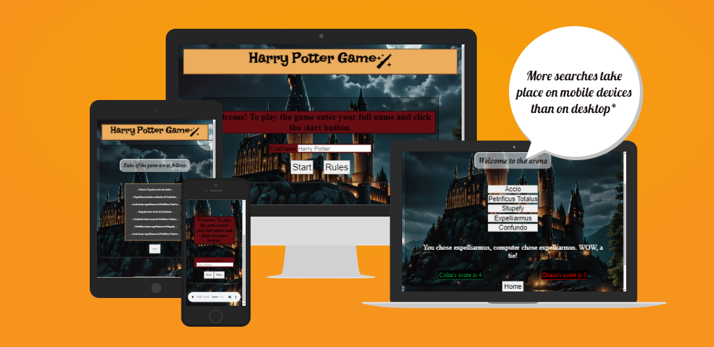

## Goals of this project

### Site owner goals

- To make a fun easy-to-play game for the user.
- To make the user feel like they are playing a Harry Potter game.
- To proivde a clean and easy-to-navigate website.

### External user goals

- To enjoy a Harry Potter-themed game
- To enjoy the music and get immersed in a fun game.
- To defeat Draco

## Design of the project 

### Strategy plane 

My overall strategy was to make a good-looking website with a functioning game based on Harry Potter.

- The website was aimed at Harry Potter fans of all ages.
- I wanted the content to be relevant to the theme (Harry Potter).
- My strategy was to get Harry Potter fans to enjoy an game with an immersive experience with the audio music in the background and a cool AI background of Hogwarts to set the scene.

### Scope plane

What's on and off the table? What features will be used?

- Functioning buttons that the user can click to bring them from one area to another. 'Home', 'Rules', 'Game Arena'
- A username input field, for the user to enter their username. The user's username will then show in the score area. 
- A full background picture of Hogwarts
- An Audio track so the user can turn on and off the music. It starts off muted. This is placed in the footer.
- A header with large text indicating the website is a Harry Potter game.
- A rules page to explain which spell beats which spell and that the first to 10 points is the winner.
- The battle arena, where the user can click a selection of spells to use against the computer (Draco). These spells will be pressable buttons.
- Text that shows if the user won or lost that round.
- A scoreboard that shows the scores for both User and Draco.
- An alert with a message saying who won the game.

### Structure plane

The structure is easy. It involves a header, and a footer, along with the main area which is covered in a nice-looking border. The structure is the same for all sections. All are styled using Flexbox. It is consistent, predictable, learnable, and visible.

### Skeleton plane

To visualize the website, I used Wireframes for my ideas using Balsamiq. I created them on larger screens with the idea of smaller screens being very similar just a smaller screen.

1. **Home page Example.**
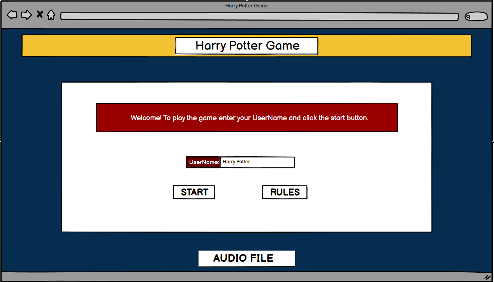

1. **Rules page Example.**
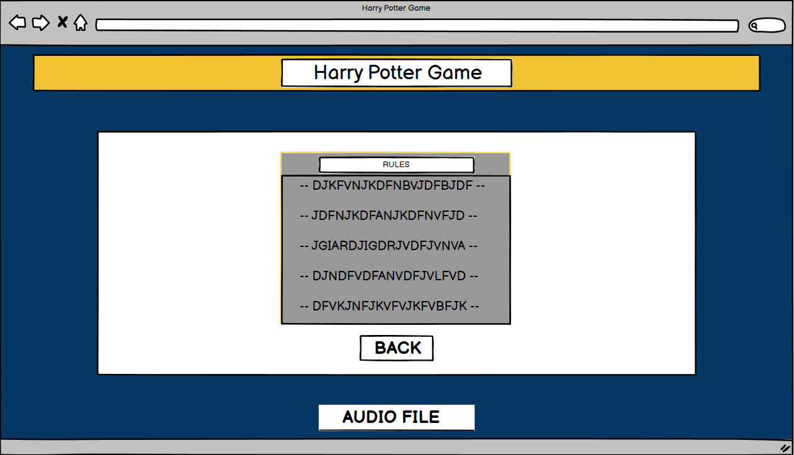

1. **Game Arena page Example.**
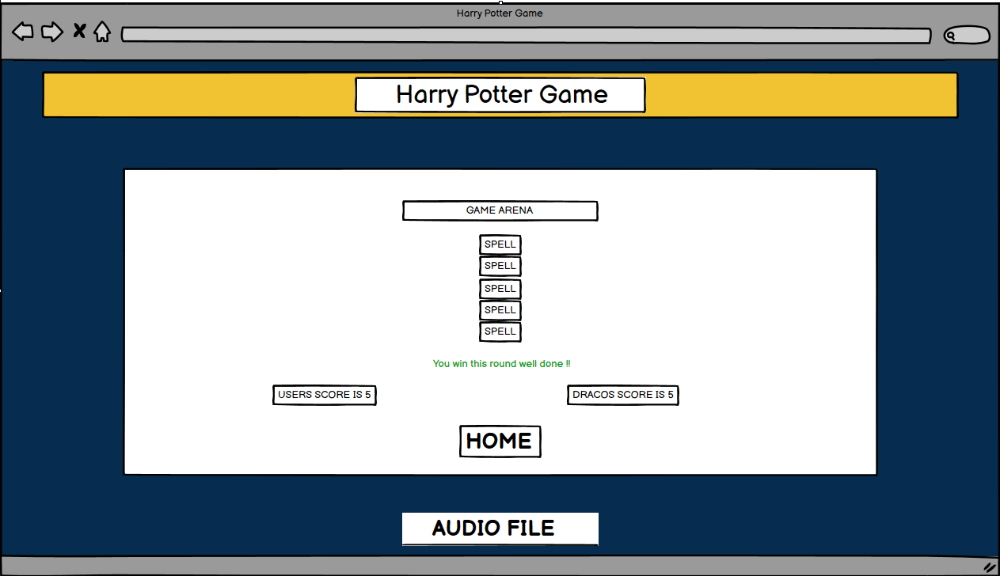

### Surface plane

On the surface plane, the color scheme I went for was Harry Potter's house called 'Gryffindor'. I searched for Gryffindor colors on Google found a Gryffindor scarf and used an eye dropper extension on Google to get the correct colors. I used a dark background image of Hogwarts to make the colors pop out and give aN eerie Gryffindor vibe as the user will be battling Draco in the Game Arena. I also used the font Lakki Reddy foR the Harry Potter Header.

- The colors used were #ecad5f & #650d13 
- Gold and Red

## Features

- **My Header** was a basic h1 text of "Harry Potter Game", with a wand from font Awesome, and Lakki Reddy font to give it a Harry Potter style. The header is visible in all 3 areas 'Home', 'Rules', and 'Game Arena'
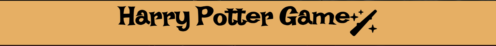

- **The main div was located in the center of the screen surrounded by a border** Inside the home area was an h2 tag with a welcome message explaining to the user to enter a UserName before starting the game. Alongside this was a UserName input field for the user to put in their username. Their UserName would then be used in the Game arena. Also inside this main div and border is the 'Start' button - this button when pressed will take the user to the Game arena to start the game. There is also a 'Rules' button that users can press to bring them to the rules area.
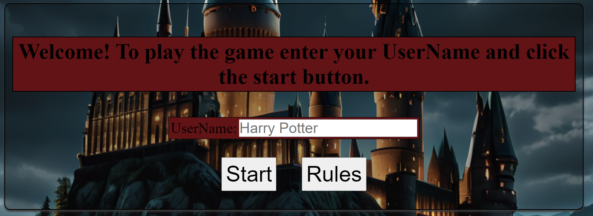

- **There is an audio feature in the footer**, that allows users to play some magical music in all three areas. The audio is muted at first and the user can un-mute the audio, press play, and pause the audio if they want. 
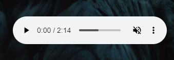

- **In the 'Rules' area the main div is styled the same with the border** but there is a h3 tag that says "Rules of the game are as follows:" and then another section with the rules of the game in a border with a grey background and white text explaining which spells beat which spells. There is also a back button for users to click to go back to the home area.
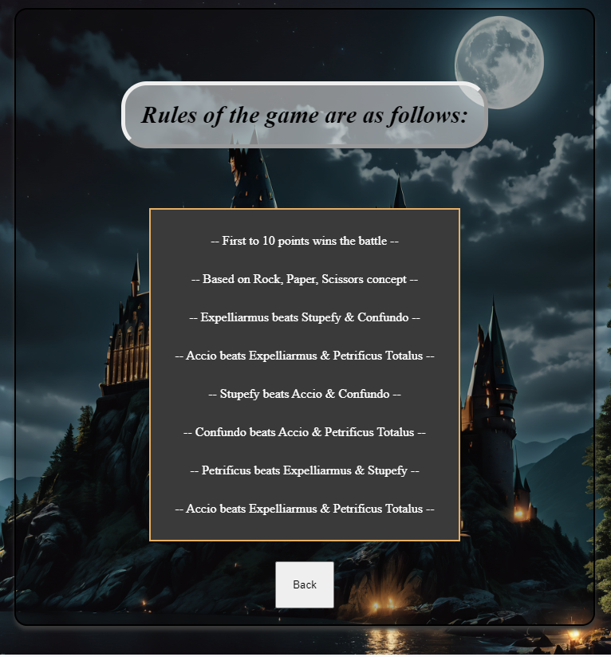

- **In the 'Game Area' the main feature is the five buttons pressable buttons**. These buttons consist of different Harry Potter spells. The user has to pick which spell they want to use. After choosing a spell, some text will pop up explaining if you won, lost, or drew that round. Along with that, a score counter pops up keeping the scores of the user's and Draco's scores. This area also consists of the header, footer and an h3 tag that says "Welcome to the arena". There is also a 'Home' button for users to go back to the 'Home' area.
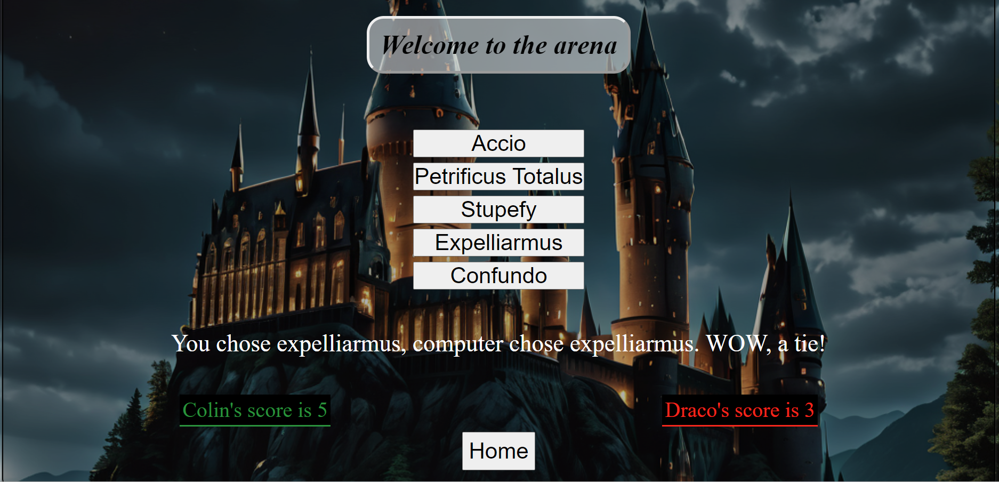

-**There is a hover feature for each button**. All buttons once hovered over will give the yellow/orange Gryffindor color to show the user that it is clickable.
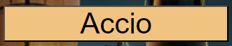

- **Lastly there is a pop up feature once the game is finished.** The pop up feature will tell the user if they won or lost the game. 
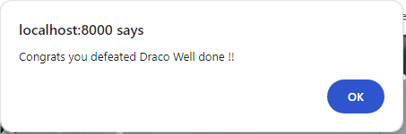
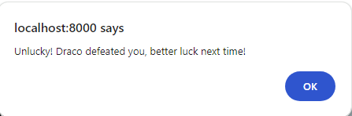

## Future Features

- I would like to add more audio to the game.
- I would like to add a unique audio for each spell every time it is clicked by the user.
- I would like to add a more intense audio file for the game arena.
- I would also like to add a specific audio to be played with you win or lose the game.

## Technologies used

Technologies used in this website were as follows:

- HTML
- CSS
- JAVASCRIPT
- GIT
- GITPOD
- BALSAMIQ WIREFRAMES
- GOOGLE DEV TOOLS
- GENCRAFT 
- FONT AWESOME
- GOOGLE FONTS
- W3C HTML Markup Validator
- W3C Jigsaw CSS Validator
- JS HINT JAVASCRIPT Validator

## Testing and Validation

### Manual testing

- I tested the live project on Google Chrome, Internet Explorer, and Firefox web browsers.
- I tested the website on iPhone, laptop and monitor screen sizes.
- I played the game over and over to make sure it was working properly.
- I got to a score of 10, winning, and losing to make sure the alert popped up properly.
- I checked all the buttons to make sure they were all working and bringing me to the correct areas.

### Validation

- I used the W3C Markup Validation service to make sure my code had no errors. After some fixes, my code came out perfect with no errors found.
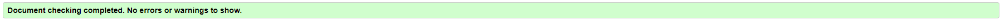

- I used the Jigsaw CSS Vlaidator to validate my CSS code.
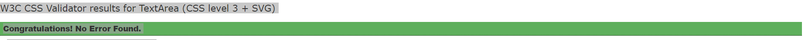 

- I used JS HINT JavaScript Validator to validate my JavaScript code. It says "One unused variable" but this is because that variable is actually linked with the HTML file and is being used.
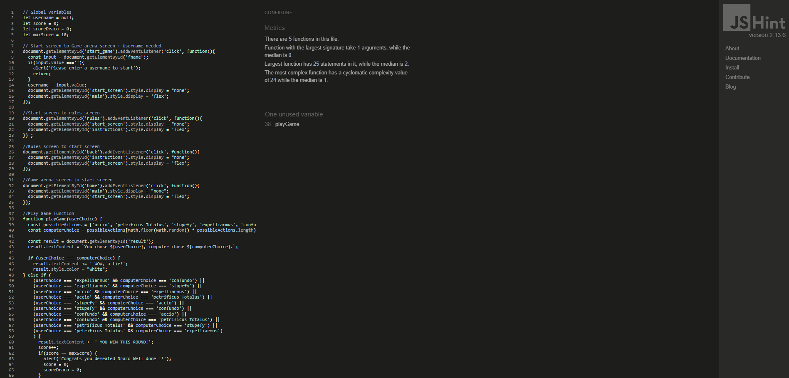

- I used Lighthouse in dev tools to measure the Performance, Accessibility, Best Practices and SEO on both desktops and phones.
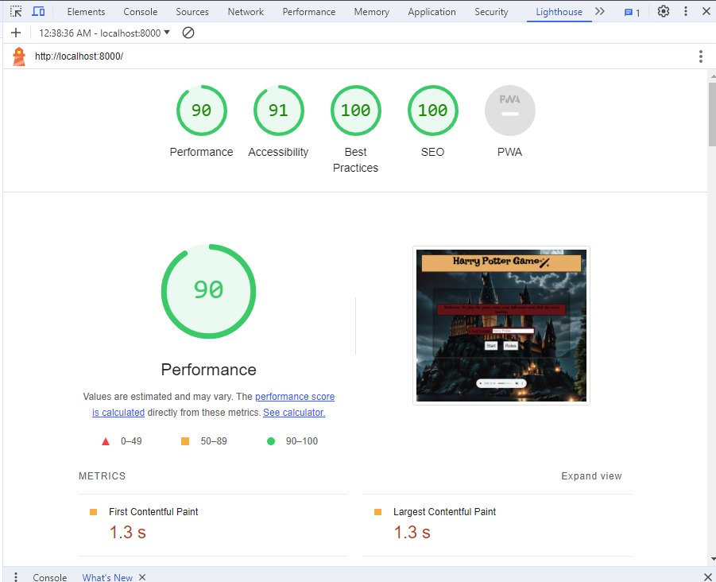
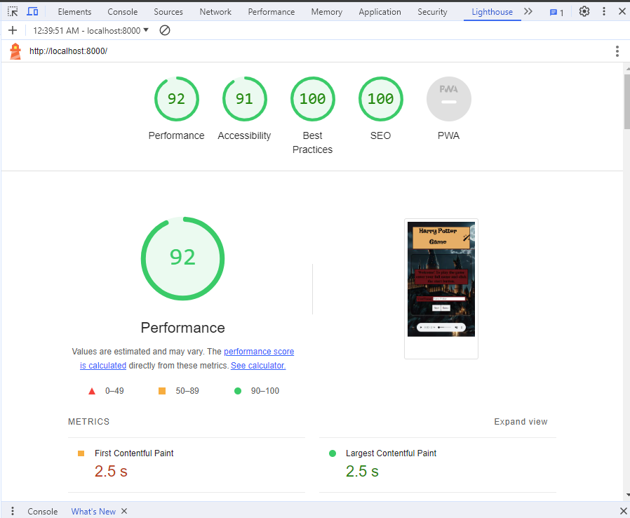

## Challenges/Bug fixes

- I had a couple of warnings and one error in my HTML validation. These included some "Trailing slashes", and  "a stray end tag on a div". These were easily fixed by taking out the stray div and getting rid of the unnecessary trailing slashes. 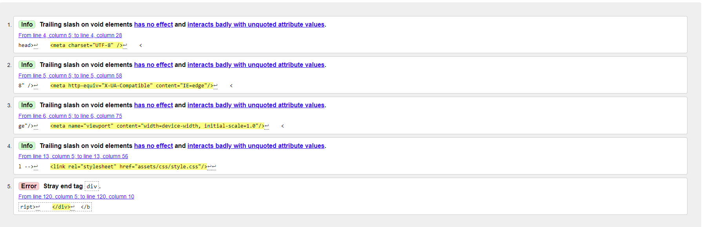

- Alongside some HTML warnings and an error, my JavaScript validator said I had "One variable unused" which confused me because I knew that variable was being used within my HTML file but of course, I did not have my HTML file inside of the JavaScript validator so this was the reason and was told it was ok. 

- I had some challenges with the responsiveness of the background image - I used various media queries to figure it out but in the end background-attachment: fixed worked wonders for me.

- Lastly, I have not been able to overcome this challenge due to time but one thing I noticed was when the user finishes the game, The scores both reset to 0 in the back-end, which is what is intended but the losers score does not show up as "0 in the front-end", It stays on the losers previous games score until they win a round and then it will show up as "Dracos/Users score is 1" which is correct because both have been reset to 0 after the previous game finished and Draco/User won a round, but I am trying to fix it so both Draco and the User are both reset to 0 on the front end after each game. The game still runs as intended and this does not interfere with the fundamentals of the game. 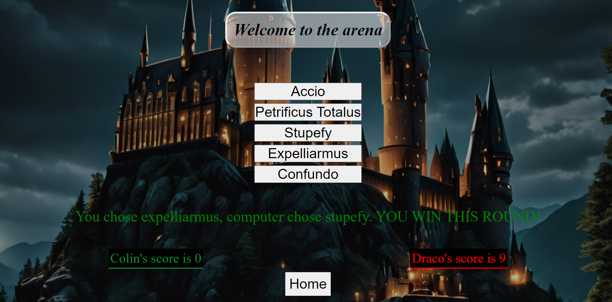 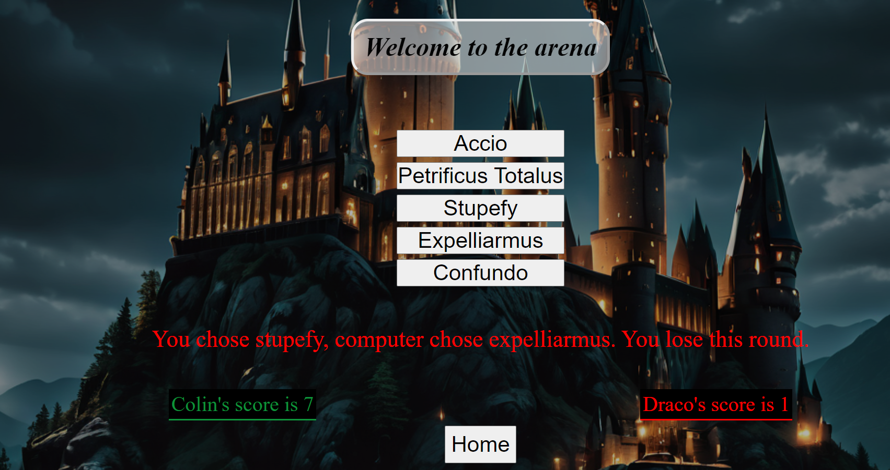

## Deployment

I deployed my website early, as this is recommended. The steps to deploying a website on GitHub pages are:

1. Open the repository and go to the Settings tab.
1. Navigate to the Pages tab in the left menu.
1. Choose Deploy from a branch and select the according branch, main.
1. Click save. Click code The link to the deployed website can be found on the right-hand side under 'Deployments' and then under 'active deployments'
   The link to my live site is: [Link to the live project here](https://breakellrz.github.io/Harry_Potter_Quiz/)

## Credit

- I would first like to thank my code institute mentor, Brian O'Hare, for guiding me providing tips and feedback during this project and helping me with some of the JavaScript code.

- I would like to credit Code Institute. Their challenges and mock projects helped me learn the fundamentals of JavaScript.
  
- I would like to credit [Gencraft](https://gencraft.com/generate) for providing me with AI-generated images which I used for my main background images.

- I would like to credit [Fontawesome](https://fontawesome.com/), for the wand icon used in this project.

- I would like to credit [Favicon](https://favicon.io), for the wand favicon.

